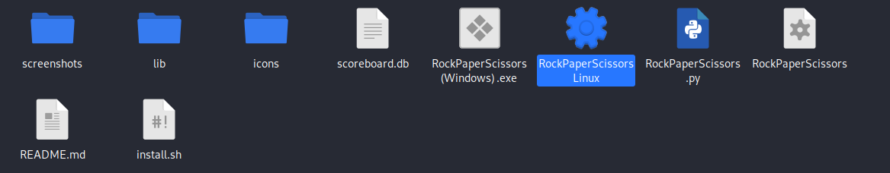
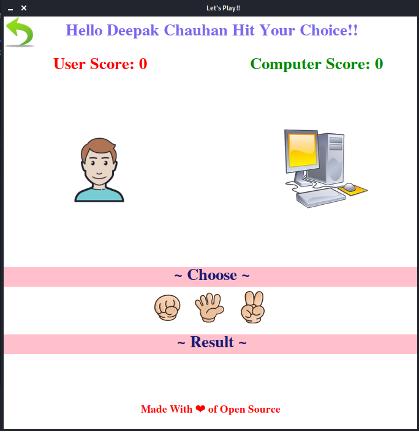
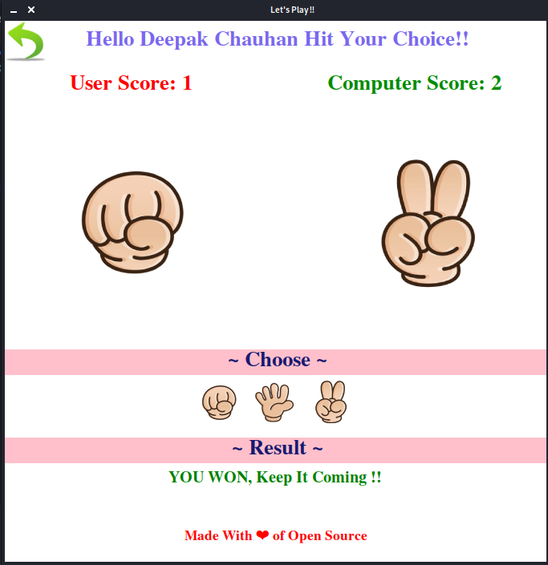
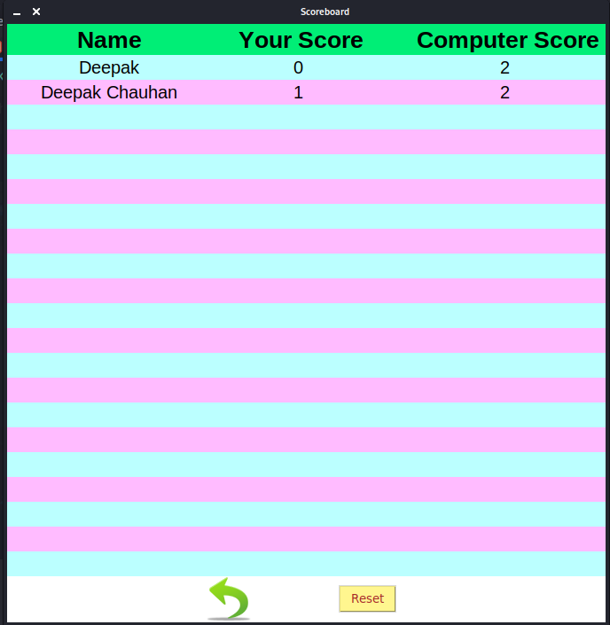

<h1 align="center">
   
  
</h1>

## About Game:

Paper–scissors-rock (also known as scissors-rock-paper or other variants) is a hand  game usually played between two people, in which each player simultaneously forms one of three shapes with an outstretched hand. These shapes are "rock" (a closed fist),"paper" (a flat hand), and "scissors" (a fist with the index finger and middle finger extended, forming a V). Scissors is identical to the two-fingered V  sign (also indicating "victory" or "peace") except that it is pointed horizontally instead of being held upright in the air.

## STEPS TO PLAY:

1. Steps to plays game :
  For Window Users :
   Right Click On RockPaperScissors.py And Click Edit With Idle.
   
  
   

  For Linux Users :
  Run 'bash install.sh' file to install application in application launcher.
  or To try it directly
  Open the RockPaperScissorsLinux file by pressing enter on it and game will be up for you.
   
  
   

2. Press F5 And Sit

3. Now Main Window Of The Game Will Open. Enter Your Name In Given Box And Press Submit. This Window Will Show Your Given Name Entered.
   
  
   

4. Now After Hitting Submit You Will Get This Window.
   
  
   

5. Now, Choose any one among Rock, Paper And Scissor.
   
  
   

5. I’ve Pressed Rock, so The Result Is Shown Below in the same screen with Scores.

6. Now To See Your Scorecard, Click On Scoreboard Button Below Submit Button on Home Screen.
   
  
   

## Game Play

HOPE YOU WILL ENJOY PLAYING IT….IF ANY ISSUES refer documentation.

## REQUIREMENTS :
### For Windows
1. `Install Python 2.7`
2. `apt-get install python-tk`

#### Steps to setup :

1. `git clone https://github.com/97shivank/RockPaperScissor`
2. `cd RockPaperScissor`
3. `python main.py`

### Contributing
Any and all contributions, issues, features and tips are welcome.
